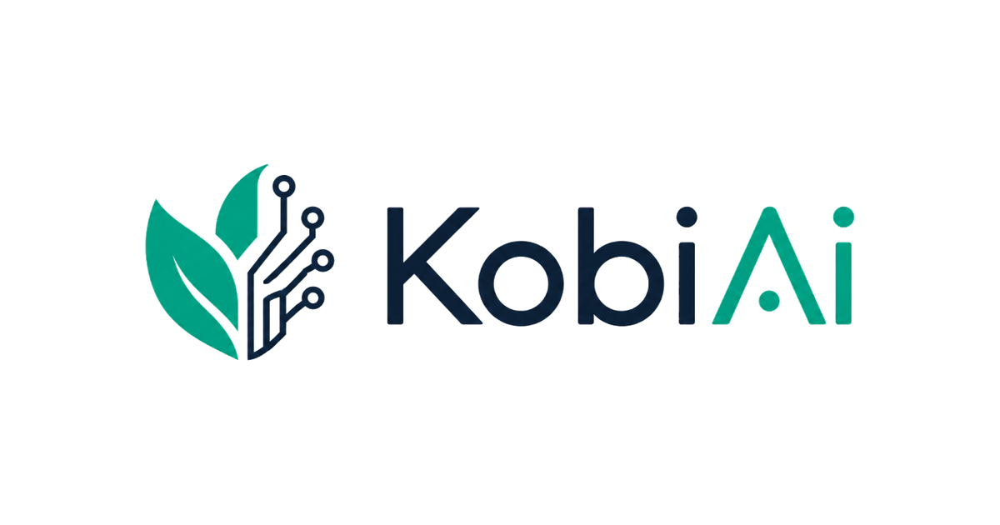

<table border="0">
  <tr>
    <td width="65%" border="0">
      <h1>KobiAI — KOBİ AI Agent</h1>
      <p><strong>Küçük ve Orta Ölçekli İşletmeler için Yapay Zekâ Destekli Operasyon Otomasyonu</strong></p>
      <p>KobiAI, KOBİ’ler ve kooperatifler için geliştirilmiş tam kapsamlı, yapay zekâ destekli bir operasyon platformudur. Ürün yönetimi, envanter takibi, sipariş izleme, kargo gözetimi ve müşteri iletişimini tek bir birleşik panelde toplar — iş verilerinizi anlayan ve bu veriler üzerinden aksiyon almanıza yardımcı olabilen konuşma tabanlı bir yapay zekâ ajanı ile birlikte çalışır.</p>
    </td>
    <td width="35%" border="0">
      
    </td>
  </tr>
</table>


---

## İçindekiler

1. [Genel Bakış](#genel-bakış)
2. [Problem Tanımı](#problem-tanımı)
3. [Hedef Kullanıcılar](#hedef-kullanıcılar)
4. [Temel Özellikler](#temel-özellikler)

   * [Admin Özellikleri](#admin-özellikleri)
   * [Müşteri Özellikleri](#müşteri-özellikleri)
   * [Yapay Zekâ Destekli Özellikler](#yapay-zekâ-destekli-özellikler)
   * [Deterministik Destek Endpoint’leri](#deterministik-destek-endpointleri)
   * [Bildirimler ve Gerçek Zamanlı Özellikler](#bildirimler-ve-gerçek-zamanlı-özellikler)
   * [Tahminleme ve Analitik](#tahminleme-ve-analitik)
5. [Yapay Zekâ Sistemi Derinlemesine İnceleme](#yapay-zekâ-sistemi-derinlemesine-inceleme)
6. [Mimari Genel Bakış](#mimari-genel-bakış)
7. [Backend Mimarisi](#backend-mimarisi)
8. [Frontend Mimarisi](#frontend-mimarisi)
9. [Teknoloji Yığını](#teknoloji-yığını)
10. [API Genel Bakış](#api-genel-bakış)
11. [Kimlik Doğrulama ve Yetkilendirme](#kimlik-doğrulama-ve-yetkilendirme)
12. [Veritabanı, Migration ve Seed](#veritabanı-migration-ve-seed)
13. [Yerel Kurulum](#yerel-kurulum)
14. [Ortam Değişkenleri](#ortam-değişkenleri)
15. [Demo Akışı](#demo-akışı)
16. [Mevcut Sınırlamalar](#mevcut-sınırlamalar)
17. [Yol Haritası](#yol-haritası)
18. [Proje Yapısı](#proje-yapısı)
19. [Geliştirme Standartları](#geliştirme-standartları)
20. [Dokümantasyon Notları](#dokümantasyon-notları)

---

## Genel Bakış

KobiAI, küçük ve orta ölçekli işletmelerin pratik ihtiyaçları için tasarlanmış yapay zekâ destekli bir operasyon otomasyon platformudur. Envanter, siparişler, kargolar ve müşteri hizmetleri için ayrı ayrı araçlar kullanmayı gerektirmek yerine, KobiAI tüm bu süreçleri tek bir admin panelinde ve sade bir müşteri arayüzünde birleştirir — her ikisi de operasyonel verilerinizi okuyabilen ve daha iyi, daha hızlı kararlar almanıza yardımcı olabilen gerçek bir yapay zekâ ajanı ile güçlendirilmiştir.

Platform **production odaklı bir mimari** üzerine kuruludur: katmanlı bir FastAPI backend, Turborepo monorepo içinde Next.js App Router frontend, kalıcı veri için PostgreSQL, önbellekleme ve konuşma belleği için Redis ve yapay zekâ motoru olarak Google Gemini. Genişletilebilir olacak şekilde tasarlanmıştır — yeni araçlar, entegrasyonlar veya modüller çekirdek mantığı yeniden yazmadan eklenebilir.

---

## Problem Tanımı

Küçük bir işletmeyi yönetmek sürekli yangın söndürmek gibidir. İşletme sahipleri ve operasyon ekipleri, can sıkıcı derecede manuel olan tekrar eden problemlerle karşılaşır:

* **Müşteri soruları tekrar eder ve zaman alır.** “Siparişim nerede?” ve “Bu ürün stokta var mı?” gibi sorular her gün ciddi destek emeği tüketir.
* **Envanter sorunları çok geç fark edilir.** Düşük stok veya hareketsiz stok, çoğu zaman ancak müşteri şikâyetinden ya da kaçırılmış satıştan sonra görülür.
* **Kargolar izlenmeden kalır.** Gecikmeler sessizce birikir ve ancak müşteriler durumu yükselttiğinde fark edilir.
* **Sipariş yönetimi dağınıktır.** Durum güncellemeleri için birden fazla ekranda gezinmek ve birden fazla kişiyle iletişim kurmak gerekir.
* **Akıllı bir katman yoktur.** Dashboard’lar veri gösterir ama bu veriyle ne yapılması gerektiğini söylemez. Adminler grafikleri yorumlamak ve kararları manuel almak zorunda kalır.
* **Bildirimler önceliklendirilmeden birikir.** Önemli operasyon uyarıları gürültü içinde kaybolur.

KobiAI, yapılandırılmış bir operasyon dashboard’unu, verilerinizi bilen ve onları anlamanıza ve aksiyona dönüştürmenize yardımcı olabilen konuşma tabanlı bir yapay zekâ ajanı ile birleştirerek bu problemlere doğrudan çözüm sunar — karar mekanizmanızı tamamen devralmadan.

---

## Hedef Kullanıcılar

| Kullanıcı Tipi                                | KobiAI Nasıl Yardımcı Olur                                                                                                 |
| --------------------------------------------- | -------------------------------------------------------------------------------------------------------------------------- |
| **KOBİ Sahipleri**                            | Her tabloyu manuel incelemeden günlük operasyon özetleri, düşük stok uyarıları ve yapay zekâ destekli içgörüler alır       |
| **Operasyon / Admin Kullanıcıları**           | Ürünleri, envanteri, siparişleri, kargoları ve bildirimleri yapay zekâ desteğiyle tek panelden yönetir                     |
| **Müşteri Destek Ekipleri**                   | Deterministik destek endpoint’leri ve yapay zekâ destekli müşteri sohbeti ile tekrar eden soruları azaltır                 |
| **Müşteriler**                                | Ürünleri inceler, sipariş verir, kargo takibi yapar, profilini yönetir ve doğal dille soru sorar                           |
| **Kooperatifler ve Küçük E-ticaret Ekipleri** | Küçük bir ekip içinde ortak ürün ve sipariş sistemini net rol ayrımıyla yönetir                                            |
| **Geliştiriciler**                            | Mevcut katmanlı mimariyi kullanarak platformu yeni yapay zekâ araçları, entegrasyonlar veya servis modülleriyle genişletir |

---

## Temel Özellikler

### Admin Özellikleri

#### Dashboard ve Analitik

* **Genel bakış kartları**, bugünün siparişlerini, aktif kargoları, düşük stoklu ürünleri ve okunmamış bildirimleri tek bakışta gösterir.
* **Haftalık performans grafiği**, Recharts kullanarak sipariş hacmini ve gelir trendlerini görselleştirir.
* **Stok sağlığı metrikleri**, kritik envanter seviyelerini operasyonel engellere dönüşmeden önce tespit eder.
* **Geciken kargo takibi**, beklenen teslimat süresini aşan gönderileri öne çıkarır.

#### Ürün Yönetimi

* Ad, SKU, kategori, fiyat, açıklama ve görseller dahil ürünler için tam CRUD.
* Arama ve filtreleme destekli ürün listeleme.
* Ürün detay ve düzenleme görünümleri.

#### Envanter Yönetimi

* Ürün bazlı mevcut miktar, düşük stok eşiği ve yeniden sipariş miktarı takibi.
* **Düşük stok** ve **kritik stok** seviyeleri için görsel göstergeler.
* Admin panelinden envanter güncelleme.
* Yapay zekâ ajanı araçları üzerinden yapay zekâ destekli envanter eşik önerileri.

#### Sipariş Yönetimi

* Durum filtreleriyle tam sipariş listeleme.
* Ürün kalemleri, müşteri ve adres bilgilerini gösteren sipariş detay görünümü.
* Admin panelinden doğrudan **sipariş durumu güncelleme**.
* Yapay zekâ ajanı tarafından öne çıkarılan sipariş öncelik içgörüleri.

#### Kargo Yönetimi

* Siparişlere bağlı kargo oluşturma.
* Takip numarası ve kargo firması atama.
* Otomatik işaretleme ile **geciken kargo takibi**.
* Kargo durumu yenileme; şu anda gerçek kargo API’leriyle genişletilecek şekilde tasarlanmıştır.

#### Bildirim Merkezi

* Operasyonel olaylar için merkezi bildirim akışı: düşük stok, kargo gecikmeleri, yeni siparişler.
* Okunmamış bildirim sayısı ve okundu olarak işaretleme işlemleri.
* Bildirim akışında oluşturulan ve gösterilen **günlük operasyonel gecikme özeti**.
* SSE tabanlı gerçek zamanlı bildirim iletimi. Bkz. [Bildirimler ve Gerçek Zamanlı Özellikler](#bildirimler-ve-gerçek-zamanlı-özellikler).

#### AI Chat Paneli (Global)

* Admin arayüzünün tamamında erişilebilen kalıcı yapay zekâ asistan paneli.
* Rol farkındalığına sahip araç erişimiyle Gemini desteklidir — yapay zekâ bir admin ile konuştuğunu bilir ve admin seviyesindeki araçları kullanıma açar.
* Talep üzerine sorgular için (“Kaç sipariş beklemede?”, “Hangi ürünler kritik seviyede düşük?”) veya proaktif öneriler için kullanılabilir.
* Güvenli yazma işlemleri için **AI Action Co-Pilot** iş akışını destekler. Bkz. [Yapay Zekâ Destekli Özellikler](#yapay-zekâ-destekli-özellikler).

---

### Müşteri Özellikleri

#### Hesap ve Kimlik Doğrulama

* Müşteri kayıt ve giriş işlemleri.
* HttpOnly cookie tabanlı oturum; localStorage’da token tutulmaz.
* Kişisel bilgiler dahil profil yönetimi.
* Adres defteri yönetimi: oluşturma, güncelleme, varsayılan adres seçimi.

#### Ürün Kataloğu

* Kategori filtreleme ve arama destekli herkese açık ürün listeleme.
* Stok uygunluğu göstergesine sahip ürün detay sayfası.

#### Sipariş Verme ve Takip

* Ürün detayından veya katalogdan doğrudan sipariş oluşturma.
* Tüm geçmiş ve aktif siparişleri listeleyen “Siparişlerim” sayfası.
* Ürün kalemleri, durum ve kargo takip bilgilerini gösteren sipariş detay görünümü.
* Kimliği doğrulanmış yapay zekâ sohbeti üzerinden doğal dilde sipariş durumu sorguları.

#### Müşteri AI Chat

* Müşteri kapsamlı araç setine sahip, kimlik doğrulamalı yapay zekâ sohbet endpoint’i.
* Müşteriler doğal dille şu soruları sorabilir: “Son siparişim nerede?”, “X ürünü stokta var mı?”, “Geçen ay ne sipariş etmiştim?”
* Yapay zekâ ajanı bu soruları gerçek veri araçlarını kullanarak yanıtlar — tahmin yürütmez.

---

### Yapay Zekâ Destekli Özellikler

Bu, KobiAI’nin temel ayrıştırıcı özelliğidir. Yapay zekâ katmanı basit bir soru-cevap widget’ı değildir — canlı operasyonel verilerinize erişebilen **araç orkestrasyonlu bir ajandır**.

#### Gemini Tabanlı Ajan

* `google-genai` SDK’sı üzerinden **Google Gemini** ile çalışır.
* Yanıt oluşturmadan önce gerçek veriyi almak için **function calling (tool use)** kullanır.
* Tüm operasyonel yanıtlar veritabanı sonuçlarına dayandırılır — ajan işletme verisini halüsinasyonla üretmez.

#### Araç Kayıt Sistemi ve Rol Farkındalıklı Erişim

* Araçlar, kullanıcı rollerine göre anahtarlanan bir **ToolRegistry** içinde kayıtlıdır.
* **Admin araçları** şunları kapsar: envanter sorguları, sipariş durumu, kargo durumu, bildirim özetleri, düşük stok tespiti, hareketsiz stok adayları, sipariş öncelik raporları, kargo risk raporları.
* **Müşteri araçları** şunları kapsar: müşteriye göre sipariş arama, siparişe göre kargo takibi, ürün stok sorgusu.
* Rol ayrımı ajan bağlamı seviyesinde uygulanır — bir müşteri oturumu admin araçlarını çağıramaz.

#### Redis Konuşma Belleği

* Konuşma geçmişi oturum bazlı olarak Redis’te saklanır.
* Bu sayede yapay zekâ mesajlar arasında bağlamı hatırlayabilen çok turlu konuşmalar yapabilir.
* Bellek oturum kapsamındadır ve otomatik olarak süresi dolacak şekilde ayarlanır.

#### Yapay Zekâ İçgörüleri

Ajan, talep üzerine veya proaktif olarak yapılandırılmış içgörüler üretebilir:

* **Hareketsiz stok adayları** — envanteri olan ancak yakın zamanda sipariş hareketi olmayan ürünler.
* **Sipariş öncelik raporu** — durum ve yaşa göre dikkat gerektiren siparişler.
* **Kargo risk raporu** — mevcut durum ve geçen süreye göre gecikme riski olan kargolar.
* **Bildirim risk özeti** — mevcut okunmamış operasyon uyarılarının önceliklendirilmiş özeti.
* **Admin sayfa bağlamı** — admin belirli bir bölüme gittiğinde yapay zekâ ilgili sayfaya uygun bağlamsal özetler sunabilir.

#### AI Action Co-Pilot (Bekleyen Aksiyon Deseni)

Yazma işlemleri için KobiAI, **güvenli aksiyon onay deseni** uygular:

1. Yapay zekâ alabileceği bir aksiyonu belirler. Örneğin: “X ürünü kritik seviyede düşük — yeniden sipariş eşiğini güncelleyebilirim.”
2. Hemen işlem yapmak yerine önerilen değişiklik ve gerekçesiyle birlikte bir **bekleyen aksiyon** oluşturur.
3. Admin’e önerilen aksiyon gösterilir ve işlemin uygulanması için adminin **açıkça onay vermesi** gerekir.
4. Ancak onaydan sonra servis katmanı değişikliği uygular.

Şu anda desteklenen yapay zekâ destekli aksiyonlar:

* Ürün fiyatı güncelleme
* Sipariş durumu güncelleme
* Envanter eşiği / miktarı güncelleme
* Kargo durumu yenileme
* Bildirimi okundu olarak işaretleme

Bu desen, **yapay zekânın insan onayı olmadan yıkıcı veya yazma etkisi olan değişiklikler yapmamasını** sağlar ve operatörü kontrolün merkezinde tutar.

---

### Deterministik Destek Endpoint’leri

LLM sohbetinden ayrı olarak KobiAI, model çıkarımı olmadan deterministik sonuçlar döndüren yapılandırılmış destek endpoint’leri sunar:

* **Sipariş numarasına göre sipariş arama** — verilen sipariş referansı için sipariş durumunu, ürünleri ve takip bilgisini döndürür.
* **Ürün adına veya SKU’ya göre stok sorgusu** — kimlik doğrulama gerektirmeden mevcut stok uygunluğunu döndürür.
* **Takip numarasına göre kargo takibi** — verilen takip referansı için kargo durumunu döndürür.

Bu endpoint’ler hızlı, güvenilir ve LLM gecikmesi olmadan müşteri tarafı widget’lara veya chatbot’lara entegre edilmeye uygundur.

---

### Bildirimler ve Gerçek Zamanlı Özellikler

* Tam bildirim geçmişi ve okunmamış sayısı rozeti içeren **bildirim merkezi**.
* Bağlı istemcilere gerçek zamanlı bildirim iletimi için **Server-Sent Events (SSE)** endpoint’i.
* **Günlük gecikme özeti** — kargo gecikmelerinin planlanmış veya tetiklenmiş özeti, bildirim olarak gösterilir.
* Backend servisleri ile SSE akışı arasındaki bildirim akışı için Redis event bus olarak kullanılır.
* Bildirimler operasyonel olaylar tarafından üretilir: düşük stok eşiklerinin aşılması, kargo gecikmeleri, yeni siparişler.

---

### Tahminleme ve Analitik

* Yakın dönem sipariş geçmişine göre ürün bazlı **haftalık talep tahmini**.
* Ürünleri sağlıklı, düşük, kritik ve hareketsiz stok kategorilerine ayıran **stok sağlığı analizi**.
* **Pazar büyüme simülasyonu** — büyüme senaryosu planlaması için genişletilebilir tahminleme modeli.
* Sipariş, gelir ve envanter trendlerini toplayan dashboard performans metrikleri.

---

## Yapay Zekâ Sistemi Derinlemesine İnceleme

Yapay zekâ sistemi, her yanıtı üretmeden önce gerçek araç sonuçlarına dayandıran bir **ReAct (Reasoning + Acting)** döngü desenini izler.

```txt
User Message
    │
    ▼
Chat Endpoint  (POST /api/chat or /api/chat/customer)
    │
    ▼
Agent Context Builder
    ├── Loads user role and identity
    ├── Loads conversation history from Redis
    └── Selects role-appropriate ToolRegistry
    │
    ▼
Gemini (google-genai)
    ├── Receives system prompt + conversation history + tools
    └── Decides: respond directly OR call a tool
    │
    ▼
Tool Dispatcher
    ├── Resolves tool name → Service method
    ├── Executes service layer query
    └── Returns ToolResult (structured data)
    │
    ▼
Gemini (second pass with tool result)
    └── Generates final human-readable response
    │
    ▼
Redis Memory Update
    └── Appends turn to session history
    │
    ▼
API Response → Frontend
```

### Temel Tasarım Kararları

| Karar                               | Gerekçe                                                                                                                           |
| ----------------------------------- | --------------------------------------------------------------------------------------------------------------------------------- |
| **Araç tabanlı grounding**          | Operasyonel veri halüsinasyonunu önler. Yapay zekâ sipariş durumlarını veya stok seviyelerini asla uydurmaz.                      |
| **Rol kapsamlı araç kayıt sistemi** | Admin ve müşteri oturumları farklı araçları görür. Erişim kontrolü yalnızca API seviyesinde değil, ajan seviyesinde de uygulanır. |
| **Bellek için Redis**               | Hafif, hızlı ve oturum kapsamlıdır. Her mesaj turu için veritabanına yazma yapılmaz.                                              |
| **Bekleyen aksiyon deseni**         | Yazma işlemleri hemen uygulanmaz, aşamalı olarak hazırlanır. Her veri değişikliği için insan onayı gerekir.                       |
| **Rol bazlı system prompt**         | Her rol, bağlamı, erişilebilir araçları ve beklenen davranışı açıklayan özelleştirilmiş bir system prompt alır.                   |
| **ToolResult tipi**                 | Tüm araçlar tipli bir `ToolResult` nesnesi döndürür; bu, araç çıktısı ayrıştırmayı güvenilir ve tutarlı hale getirir.             |

---

## Mimari Genel Bakış

```txt
┌─────────────────────────────────────────────┐
│              Browser / Client               │
│                                             │
│  Next.js App Router (TypeScript)            │
│  ├── TanStack Query (server state)          │
│  ├── Zustand (client/UI state)              │
│  └── API Client (fetch + cookie auth)       │
└──────────────────┬──────────────────────────┘
                   │ HTTP / SSE
┌──────────────────▼──────────────────────────┐
│              FastAPI Application            │
│                                             │
│  ├── API Router Layer                       │
│  ├── Dependency Injection (auth, DB, Redis) │
│  ├── Service Layer (business logic)         │
│  ├── Repository Layer (DB access)           │
│  └── Agent Layer (AI orchestration)         │
└───────┬──────────────┬──────────────────────┘
        │              │
┌───────▼──────┐  ┌────▼─────────────────────┐
│  PostgreSQL  │  │         Redis             │
│  (primary DB)│  │  (cache + AI memory +     │
│  + Alembic   │  │   notification events)    │
└──────────────┘  └──────────────────────────┘
                          │
              ┌───────────▼──────────┐
              │    Google Gemini     │
              │  (via google-genai)  │
              └──────────────────────┘
```

---

## Backend Mimarisi

Backend, temiz mimari prensiplerini izleyen **katmanlı bir FastAPI uygulamasıdır**. Her katmanın tek bir sorumluluğu vardır; bu da kod tabanını test edilebilir ve genişletilebilir hale getirir.

### Katman Sorumlulukları

| Katman              | Konum                       | Sorumluluk                                                          |
| ------------------- | --------------------------- | ------------------------------------------------------------------- |
| **API / Endpoints** | `backend/app/api/`          | HTTP yönlendirme, istek ayrıştırma, yanıt formatlama                |
| **Dependencies**    | `backend/app/api/deps/`     | Auth doğrulama, DB session injection, Redis injection               |
| **Services**        | `backend/app/services/`     | İş mantığı, repository’ler arası orkestrasyon                       |
| **Repositories**    | `backend/app/repositories/` | SQLAlchemy async ORM ile veritabanı sorguları                       |
| **Models**          | `backend/app/models/`       | SQLAlchemy ORM tablo tanımları                                      |
| **Schemas**         | `backend/app/schemas/`      | Pydantic v2 request/response doğrulama                              |
| **Agent**           | `backend/app/agent/`        | AI orchestrator, tool registry, system prompts, pending actions     |
| **Integrations**    | `backend/app/integrations/` | Dış API adaptörleri: kargo sağlayıcıları vb.                        |
| **Workers**         | `backend/app/workers/`      | Background task workers; mevcut fakat varsayılan olarak aktif değil |
| **Core**            | `backend/app/core/`         | Config, security, response builder, exception handlers              |
| **DB**              | `backend/app/db/`           | Async engine, session factory, health check                         |

### Temel Backend Desenleri

* **Standart `ApiResponse` wrapper’ı** — tüm endpoint’ler tutarlı bir zarf döndürür: `{ success, data, message, errors }`.
* **Async SQLAlchemy** — tüm veritabanı işlemleri bloklamayan I/O için tamamen async çalışır.
* **Dependency injection** — auth user, DB session ve Redis client her istek için FastAPI `Depends` ile enjekte edilir.
* **Exception handling** — global exception handler’lar domain exception’larını uygun HTTP status code’larına eşler.
* **Alembic migrations** — tüm şema değişiklikleri versiyonlanır ve yeniden üretilebilir durumdadır.
* **Idempotent seed sistemi** — demo verisi ilk çalıştırmada seed edilir ve tekrar çalıştırmaya güvenlidir.
* **Health endpoint’i** — `/health`, hazır olduğunu bildirmeden önce DB ve Redis bağlantısını kontrol eder.

### Dizin Referansı

```txt
backend/
├── app/
│   ├── api/           # Routers and endpoint handlers
│   │   ├── v1/        # Versioned API routes
│   │   └── deps/      # FastAPI dependencies (auth, DB, Redis)
│   ├── agent/         # AI agent: orchestrator, tools, memory, prompts
│   ├── core/          # Config, security utils, response builder
│   ├── db/            # Async engine, session factory, health
│   ├── integrations/  # External service adapters
│   ├── models/        # SQLAlchemy ORM models
│   ├── repositories/  # Async database query layer
│   ├── schemas/       # Pydantic v2 schemas
│   ├── services/      # Business logic layer
│   └── workers/       # Background workers (optional/extendable)
├── alembic/           # Migration scripts
├── scripts/           # Seed and utility scripts
├── pyproject.toml
└── Dockerfile
```

---

## Frontend Mimarisi

Frontend, **Turborepo monorepo** içinde yer alan, uygulama, paylaşılan paketler ve UI primitive’leri arasında temiz bir ayrım kullanan bir **Next.js 15 App Router** uygulamasıdır.

### Uygulama Yapısı (`frontend/apps/web/`)

Route group’lar admin, müşteri ve public alanlarını ayırır:

```txt
app/
├── (admin)/           # Admin-only pages (dashboard, products, orders, etc.)
├── (customer)/        # Customer-facing pages (catalog, my orders, profile)
├── (public)/          # Unauthenticated pages (login, register, landing)
└── layout.tsx         # Root layout with theme, auth gate, notification SSE
```

### Monorepo Paketleri (`frontend/packages/`)

| Paket          | Sorumluluk                                                              |
| -------------- | ----------------------------------------------------------------------- |
| `core`         | API client, temel fetch yardımcıları, auth token handling               |
| `domain`       | Domain’e özgü React hook’ları: useProducts, useOrders, useInventory vb. |
| `state`        | Global UI state için Zustand store’ları: notifications, AI panel, auth  |
| `theme`        | Tailwind config, CSS değişkenleri, dark/light theme token’ları          |
| `ui-web`       | Uygulama seviyesinde UI component’leri: cards, tables, forms, charts    |
| `ui-contracts` | Paylaşılan component interface tipleri ve prop contract’ları            |
| `i18n`         | Internationalization yardımcıları ve string sabitleri                   |

### Temel Frontend Desenleri

* **TanStack Query**, tüm server state’i yönetir: veri çekme, cache, invalidation, optimistic update. Manuel loading state veya `useEffect` fetch zincirleri yoktur.
* **Zustand**, global UI state’i yönetir: AI panel open/close, notification drawer, auth session.
* **System readiness gate** — app, protected route’ları render etmeden önce backend health kontrolü yapar; böylece startup sırasında eksik render engellenir.
* **Auth session sync** — session state backend’den türetilir: HttpOnly cookie’ler. Frontend token saklamaz; cookie’ye güvenir ve session’ı `/auth/me` çağrısı ile doğrular.
* **Global AI assistant panel** — tüm admin sayfalarında kullanılabilen, chat API ile çalışan ve rol farkındalıklı bağlam kullanan slide-over panel.
* **Notification SSE** — root layout içinde kalıcı EventSource bağlantısı gerçek zamanlı bildirimleri alır ve Zustand notification store’unu günceller.
* **Domain hook’ları**, tüm veri çekmeyi soyutlar. Page component’leri raw API call değil hook kullanır. Bu, UI’ı transport katmanından ayırır.

---

## Teknoloji Yığını

### Backend

| Teknoloji            | Versiyon    | Neden                                                                                  |
| -------------------- | ----------- | -------------------------------------------------------------------------------------- |
| **Python**           | 3.12        | Modern async desteği, type hints, performans iyileştirmeleri                           |
| **FastAPI**          | 0.115       | OpenAPI generation ile yüksek performanslı async HTTP framework                        |
| **SQLAlchemy**       | 2.x (async) | Tam async desteğe sahip olgun ORM; çoğu Python geliştiricisi için tanıdık              |
| **PostgreSQL**       | 16          | Yapılandırılmış operasyonel veri için güvenilir, zengin özellikli ilişkisel veritabanı |
| **Alembic**          | latest      | SQLAlchemy modellerine bağlı şema migration yönetimi                                   |
| **Redis**            | 7           | AI konuşma belleği, bildirim olayları ve caching için in-memory store                  |
| **Pydantic**         | v2          | Request/response schema’ları için hızlı ve ergonomik veri doğrulama ve serialization   |
| **python-jose**      | latest      | JWT token üretimi ve doğrulama                                                         |
| **passlib / bcrypt** | latest      | Güvenli parola hashing                                                                 |
| **google-genai**     | latest      | AI agent function calling için resmi Google Gemini SDK                                 |
| **Docker / Compose** | latest      | Yeniden üretilebilir yerel geliştirme ve deployment ortamı                             |

### Frontend

| Teknoloji                   | Versiyon | Neden                                                                        |
| --------------------------- | -------- | ---------------------------------------------------------------------------- |
| **Next.js**                 | 15       | Server components, streaming ve file-based routing destekli App Router       |
| **React**                   | 19       | Concurrent özelliklere sahip component modeli                                |
| **TypeScript**              | 5        | API contract’ları dahil tüm frontend genelinde type safety                   |
| **pnpm**                    | latest   | Monorepo’lar için hızlı ve disk verimli package manager                      |
| **Turborepo**               | latest   | Cache ve paralel task execution ile monorepo build orchestration             |
| **TanStack Query**          | v5       | Cache ve background refetch ile deklaratif server state yönetimi             |
| **Zustand**                 | latest   | UI ve session data için hafif global state                                   |
| **Tailwind CSS**            | v3       | Theme package üzerinden tutarlı design token’ları kullanan utility-first CSS |
| **Radix UI / shadcn-style** | latest   | Temel olarak kullanılan erişilebilir, unstyled component primitive’leri      |
| **Framer Motion**           | latest   | Sayfa geçişleri ve mikro etkileşimler için animation library                 |
| **Recharts**                | latest   | Dashboard performans görselleştirmeleri için composable chart library        |
| **next-themes**             | latest   | Sistem farkındalıklı dark/light theme yönetimi                               |

### AI Stack

| Bileşen                   | Teknoloji               | Rol                                                      |
| ------------------------- | ----------------------- | -------------------------------------------------------- |
| **LLM**                   | Google Gemini           | Reasoning, doğal dil üretimi, tool call orchestration    |
| **Tool Interface**        | Gemini Function Calling | Tipli input/output ile yapılandırılmış tool invocation   |
| **Conversation Memory**   | Redis (per-session)     | Veritabanı yazımı olmadan çok turlu bağlam               |
| **Tool Registry**         | Custom (Python)         | Role-scoped tool registration and dispatch               |
| **Agent Context**         | Custom orchestrator     | Request başına system prompt, history ve tools oluşturur |
| **Pending Action System** | Custom (service layer)  | Admin onayı bekleyen aşamalı write operation’lar         |

---

## API Genel Bakış

Tüm API route’ları `/api/v1/` altında versioned olarak yer alır. Her yanıt standart envelope formatını izler:

```json
{
  "success": true,
  "data": { ... },
  "message": "Operation successful",
  "errors": null
}
```

### Endpoint Grupları

| Grup                | Base Path               | Açıklama                                                          |
| ------------------- | ----------------------- | ----------------------------------------------------------------- |
| **Auth**            | `/api/v1/auth`          | Login, logout, refresh token, current user (`/me`)                |
| **Users / Profile** | `/api/v1/users`         | Profil okuma/güncelleme, parola değiştirme                        |
| **Addresses**       | `/api/v1/addresses`     | Address CRUD, varsayılan adres seçimi                             |
| **Products**        | `/api/v1/products`      | Product CRUD (admin), product listing (public/customer)           |
| **Inventory**       | `/api/v1/inventory`     | Inventory read/update, low-stock and critical-stock queries       |
| **Orders**          | `/api/v1/orders`        | Order creation (customer), listing, status update (admin), detail |
| **Shipments**       | `/api/v1/shipments`     | Shipment creation, status update, delayed shipment listing        |
| **Notifications**   | `/api/v1/notifications` | Notification listing, mark-as-read, unread count, SSE stream      |
| **Chat / AI**       | `/api/v1/chat`          | Admin AI chat; müşteri AI chat için `/api/v1/chat/customer`       |
| **Forecast**        | `/api/v1/forecast`      | Weekly demand forecast, stock health analysis                     |
| **Support**         | `/api/v1/support`       | Deterministic order lookup, stock query, cargo tracking           |
| **Health**          | `/health`               | DB + Redis connectivity check, service readiness döndürür         |

---

## Kimlik Doğrulama ve Yetkilendirme

KobiAI genelinde **HttpOnly cookie tabanlı kimlik doğrulama** kullanır.

* Login sırasında backend, `access_token` ve `refresh_token` değerlerini HttpOnly, Secure, SameSite cookie’leri olarak set eder.
* **Token’lar `localStorage` veya `sessionStorage` içinde saklanmaz** — bu, yaygın bir XSS saldırı yüzeyini ortadan kaldırır.
* Access token, kullanıcı ID’si ve rolünü (`admin` veya `customer`) içeren imzalı bir JWT’dir.
* Refresh token, tekrar login gerektirmeden session’ları sessizce yenilemek için kullanılır.
* **Backend doğruluğun ana kaynağıdır** — frontend auth state’i local storage’dan değil, yükleme sırasında `/auth/me` çağrısından türetir.
* **Rol tabanlı erişim**, dependency katmanında uygulanır: `Depends(get_current_admin_user)` ve `Depends(get_current_user)`. Frontend route guard’ları yalnızca UX kolaylığıdır — backend enforcement’ın yerini almaz.
* Yapay zekâ ajanı da kimliği doğrulanmış kullanıcı bağlamını alır ve ajan katmanında role-scoped tool access uygular.

---

## Veritabanı, Migration ve Seed

### PostgreSQL

PostgreSQL 16 birincil veri deposu olarak kullanılır. Tüm tablolar SQLAlchemy async ORM modelleri olarak tanımlanır ve Alembic ile versioned hale getirilir.

### Alembic Migrations

```bash
# Generate a new migration after model changes
docker compose exec api alembic revision --autogenerate -m "describe_change"

# Apply pending migrations
docker compose exec api alembic upgrade head

# Downgrade one step
docker compose exec api alembic downgrade -1
```

### Seed Sistemi

**Idempotent seed script**, ilk çalıştırmada veritabanını demo verisiyle doldurur:

* Demo admin user
* Demo customer users
* Sample products and categories
* Sample inventory records
* Sample orders and shipments
* Sample notifications

Seed tekrar çalıştırmaya güvenlidir — kayıt eklemeden önce mevcut kayıtları kontrol eder. Demo credential’ları environment variable’lar üzerinden yapılandırılabilir. Bkz. `.env.example`.

### Health Readiness

`/health` endpoint’i sağlıklı durum döndürmeden önce PostgreSQL ve Redis bağlantısını doğrular. Frontend system readiness gate, başlangıç sırasında bu endpoint’i poll eder.

---

## Yerel Kurulum

### Gereksinimler

* Docker & Docker Compose
* Node.js 20+ ve pnpm (frontend için)
* Git

### 1. Clone ve Configure

```bash
git clone https://github.com/your-org/kobiai.git
cd kobiai

# Copy backend environment config
cp backend/.env.example backend/.env

# Copy frontend environment config
cp frontend/apps/web/.env.example frontend/apps/web/.env.local
```

`backend/.env` dosyasını düzenleyin ve **Google Gemini API key** ile diğer gerekli değerleri girin.

### 2. Backend’i Başlatma (Docker Compose)

```bash
# Build and start all services (API, PostgreSQL, Redis)
docker compose up --build -d

# Watch logs
docker compose logs -f api

# Check health
curl http://localhost:8000/health
```

Backend şunları yapar:

1. PostgreSQL ve Redis hazır olana kadar bekler.
2. Alembic migration’ları otomatik çalıştırır.
3. Demo verisi oluşturmak için seed script’ini çalıştırır.
4. **8000 portunda** hizmet vermeye başlar.

### 3. Servisleri Doğrulama

| Servis                 | URL / Port                   |
| ---------------------- | ---------------------------- |
| **FastAPI backend**    | `http://localhost:8000`      |
| **API docs (Swagger)** | `http://localhost:8000/docs` |
| **PostgreSQL**         | `localhost:5432`             |
| **Redis**              | `localhost:6379`             |

### 4. Frontend’i Başlatma

```bash
cd frontend

# Install dependencies
pnpm install

# Start development server
pnpm dev
```

Frontend **`http://localhost:3000`** adresinde kullanılabilir olur.

### Kullanışlı Docker Komutları

```bash
# Stop all services
docker compose down

# Reset database (drops volumes)
docker compose down -v

# Rebuild without cache
docker compose build --no-cache

# Run migrations manually
docker compose exec api alembic upgrade head

# Run seed manually
docker compose exec api python scripts/seed.py

# Open a shell in the API container
docker compose exec api bash
```

---

## Ortam Değişkenleri

### Backend (`backend/.env`)

| Değişken                      | Açıklama                                           |
| ----------------------------- | -------------------------------------------------- |
| `DATABASE_URL`                | PostgreSQL async connection string                 |
| `REDIS_URL`                   | Redis connection string                            |
| `SECRET_KEY`                  | JWT signing secret; güçlü rastgele değer üretin    |
| `ACCESS_TOKEN_EXPIRE_MINUTES` | Access token TTL in minutes                        |
| `REFRESH_TOKEN_EXPIRE_DAYS`   | Refresh token TTL in days                          |
| `GEMINI_API_KEY`              | Google Gemini API key                              |
| `GEMINI_MODEL`                | Gemini model name, örn. `gemini-1.5-pro`           |
| `CORS_ORIGINS`                | Allowed CORS origins, örn. `http://localhost:3000` |
| `SEED_ADMIN_EMAIL`            | Demo admin account email                           |
| `SEED_ADMIN_PASSWORD`         | Demo admin account password                        |
| `ENVIRONMENT`                 | `development` veya `production`                    |

### Frontend (`frontend/apps/web/.env.local`)

| Değişken                   | Açıklama                                           |
| -------------------------- | -------------------------------------------------- |
| `NEXT_PUBLIC_API_BASE_URL` | Backend API base URL, örn. `http://localhost:8000` |
| `NEXT_PUBLIC_APP_ENV`      | App environment label                              |

> **Güvenlik notu:** Gerçek secret değerlerini asla version control’e commit etmeyin. `.env.example` dosyaları yalnızca placeholder değerler içerir.

---

## Demo Akışı

### Admin Demo

1. Seed edilmiş admin credential’ları ile `http://localhost:3000` adresinden **giriş yapın**.
2. **Dashboard** — genel bakış kartlarını inceleyin: bugünün siparişleri, aktif kargolar, düşük stok sayısı, okunmamış bildirimler. Haftalık performans grafiğini kontrol edin.
3. **AI Summary** — yapay zekâ asistan panelini açın. Şunu sorun: *“Give me a summary of today's operational status.”* Yapay zekâ envanter, sipariş ve bildirim araçlarını çağırıp bir yanıt sentezler.
4. **Inventory** — Inventory bölümüne gidin. Düşük stok veya kritik olarak işaretlenen ürünleri gözlemleyin. Yapay zekâya şunu sorun: *“Which products are critically low and what should I do?”*
5. **AI Action** — yapay zekâ bekleyen bir aksiyon önerebilir; örneğin yeniden sipariş eşiğini güncellemek. Önerilen değişikliği inceleyin ve onaylayın veya reddedin.
6. **Orders** — Orders bölümüne gidin. Pending durumuna göre filtreleyin. Bir sipariş durumunu güncelleyin. Yapay zekâya şunu sorun: *“Which orders need urgent attention?”*
7. **Shipments** — Shipments bölümüne gidin. Geciken kargoları inceleyin. Yapay zekâdan shipment risk report isteyin.
8. **Notifications** — bildirim merkezini açın. Uyarıları inceleyin. Bildirimleri okundu olarak işaretleyin.
9. **AI Chat (free-form)** — herhangi bir şey sorun: *“What are the top three things I should focus on today?”*

### Müşteri Demo

1. Yeni müşteri hesabı **oluşturun** veya seed edilmiş müşteri hesabıyla giriş yapın.
2. **Browse Products** — ürün kataloğunu keşfedin. Ürün detay sayfalarında uygunluğu kontrol edin.
3. **Create Order** — bir veya daha fazla ürün için sipariş oluşturun.
4. **My Orders** — My Orders bölümüne gidin. Yeni siparişi ve mevcut durumunu görüntüleyin.
5. **AI Chat** — şunu sorun: *“Where is my last order?”* veya *“Is [product name] in stock?”* Yapay zekâ canlı veriyi kullanarak yanıtlar.
6. **Profile & Address** — profil bilgilerini güncelleyin. Teslimat adresi ekleyin.

---

## Mevcut Sınırlamalar

Aşağıdakiler platformun demo/MVP olarak mevcut durumuna dair dürüst değerlendirmelerdir:

* **Kargo sağlayıcı entegrasyonu mock’tur.** Kargo takip entegrasyonu gerçek bir kargo API’siyle genişletilecek şekilde tasarlanmıştır; örneğin Türkiye’de Aras, Yurtiçi, PTT Kargo. Ancak şu anda simüle edilmiş takip yanıtları kullanır.
* **Background worker’lar mevcut fakat varsayılan olarak aktif değildir.** Worker altyapısı, örneğin RabbitMQ tabanlı background task’lar, genişletilebilirlik için kod tabanında bulunur ancak varsayılan `docker compose up` stack’inin parçası değildir.
* **Ödeme veya sepet sistemi yoktur.** KobiAI şu anda ödeme altyapısı, shopping cart veya refund flow implement etmez. Siparişler doğrudan oluşturulur.
* **Test coverage sınırlıdır.** Mimari test edilebilirlik için tasarlanmıştır: katmanlı ve dependency-injected. Ancak kapsamlı unit ve integration test suite’leri henüz mevcut değildir.
* **Public support UI minimaldir.** Deterministik destek endpoint’leri backend’de implement edilmiştir; özel bir public-facing support widget UI kısmi olabilir veya bulunmayabilir.
* **Yapay zekâ yazma aksiyonları açık admin onayı gerektirir** — bu tasarım gereğidir, ancak AI’ın açıkça faydalı olsa bile değişiklikleri otonom olarak uygulayamayacağı anlamına gelir.
* **Tahminleme modelleri sezgiseldir.** Weekly demand forecast ve stock health analysis, ML-trained modeller yerine yakın dönem sipariş geçmişi ve yapılandırılabilir kurallar kullanır.
* **Single-tenant mimari.** Mevcut veri modeli tek bir işletme instance’ını destekler. Multi-tenancy için schema ve auth değişiklikleri gerekir.

---

## Yol Haritası

Bu platform için gerçekçi sonraki geliştirmeler:

* [ ] **Gerçek kargo sağlayıcı entegrasyonu** — canlı takip verisi için gerçek carrier API’lerine bağlanma.
* [ ] **Ödeme ve iade akışı** — sipariş yaşam döngüsü yönetimiyle bir ödeme altyapısı entegre etme: Stripe, iyzico vb.
* [ ] **Shopping cart** — session persistence ile sipariş öncesi cart state.
* [ ] **Gelişmiş rol ve yetki sistemi** — admin rolü içinde granular permissions; örneğin yalnızca envanter yetkisi veya full admin.
* [ ] **Tedarikçi yönetimi** — ürün bazlı supplier takibi, supplier’lara yeniden sipariş önerilerini otomatikleştirme.
* [ ] **Çok kanallı müşteri mesajlaşması** — sipariş durumu güncellemeleri için WhatsApp, email veya SMS bildirimleri.
* [ ] **Geliştirilmiş tahminleme** — geçmiş sipariş verilerini kullanan ML-based demand forecasting.
* [ ] **Kapsamlı test suite** — services/repositories için unit test’ler, API endpoint’leri için integration test’ler.
* [ ] **Observability** — structured logging, distributed tracing (OpenTelemetry) ve metrics (Prometheus/Grafana).
* [ ] **Production deployment pipeline** — otomatik migrations, health checks ve rollback destekli CI/CD.
* [ ] **Multi-tenant support** — SaaS deployment için schema-level veya row-level tenant isolation.
* [ ] **Webhook system** — harici sistemlerle entegrasyon için order event’leri üzerinde outbound webhooks.
* [ ] **AI model configurability** — Gemini dışında birden fazla LLM backend desteği.

---

## Proje Yapısı

```txt
kobiai/
├── backend/
│   ├── app/
│   │   ├── agent/          # AI orchestrator, tools, memory, prompts
│   │   ├── api/
│   │   │   ├── v1/         # API route handlers
│   │   │   └── deps/       # FastAPI dependencies
│   │   ├── core/           # Config, security, response builder
│   │   ├── db/             # Async DB engine and session
│   │   ├── integrations/   # External API adapters
│   │   ├── models/         # SQLAlchemy ORM models
│   │   ├── repositories/   # Async DB query layer
│   │   ├── schemas/        # Pydantic v2 schemas
│   │   ├── services/       # Business logic layer
│   │   └── workers/        # Background task workers (optional)
│   ├── alembic/            # Migration scripts
│   ├── scripts/            # Seed and utility scripts
│   ├── pyproject.toml
│   ├── Dockerfile
│   └── .env.example
│
├── frontend/
│   ├── apps/
│   │   └── web/
│   │       ├── app/
│   │       │   ├── (admin)/     # Admin route group
│   │       │   ├── (customer)/  # Customer route group
│   │       │   └── (public)/    # Public/auth route group
│   │       ├── components/      # App-level components
│   │       └── .env.example
│   ├── packages/
│   │   ├── core/            # API client and base utilities
│   │   ├── domain/          # Domain hooks (useOrders, useInventory…)
│   │   ├── state/           # Zustand stores
│   │   ├── theme/           # Tailwind config and design tokens
│   │   ├── ui-web/          # UI component library
│   │   ├── ui-contracts/    # Component interface types
│   │   └── i18n/            # Internationalization
│   ├── package.json
│   └── turbo.json
│
├── docker-compose.yml
└── README.md
```

---

## Geliştirme Standartları

### Backend

* **Katmanlı mimari** — endpoint → service → repository → model. Endpoint’lerden repository çağrısı yapılmaz; service katmanında HTTP concern bulunmaz.
* **Standart `ApiResponse`** — her endpoint aynı envelope yapısını döndürür. Consumer’lar tutarlı bir shape’e güvenebilir.
* **Async-first** — tüm I/O işlemleri async çalışır: DB, Redis, external HTTP. Request path içinde blocking call bulunmaz.
* **Pydantic v2 schema’ları** — request body’leri ve response model’leri tamamen typed ve validated durumdadır. Katmanlar arasında raw dict aktarılmaz.
* **Dependency injection** — auth context, DB session ve Redis her request için enjekte edilir; business logic içinde global singleton kullanılmaz.

### Frontend

* **Domain hook’ları** — tüm data fetching, `packages/domain` paketi içindeki domain hook’larında kapsüllenir. Page component’leri API client’ı doğrudan import etmez.
* **Server state ve UI state ayrımı** — TanStack Query server-derived data’nın tamamına sahiptir. Zustand UI state’e sahiptir: panel open/close, selected items, auth session. Bunlar asla karıştırılmaz.
* **TypeScript strict mode** — tüm frontend strict checks ile TypeScript’tir. API response tipleri `ui-contracts` paketi üzerinden paylaşılır.
* **Cookie-based auth** — localStorage veya sessionStorage içinde asla token tutulmaz. Auth state browser’dan değil backend’den türetilir.
* **Component composability** — `ui-web` içindeki UI component’leri Radix UI primitive’leri üzerine kurulur ve iyi tiplendirilmiş prop’lar alır. Uygulamaya özel logic, UI component’lerinde değil page component’lerinde ve domain hook’larında yer alır.

---

## Dokümantasyon Notları

Bu README, yazıldığı anda mevcut olan repository yapısı, environment configuration dosyaları ve proje spesifikasyonları temel alınarak hazırlanmıştır. Kod tabanının mevcut durumunu yansıtır ve implement edilmiş özellikler ile planlanan işlevler konusunda doğru ve dürüst olmayı amaçlar.

Proje geliştikçe bu README şu konuları yansıtacak şekilde güncellenmelidir:

* Yeni özellikler ve endpoint’ler eklendikçe.
* Teknoloji yığınındaki değişiklikler.
* Portlar, komutlar veya Docker configuration değişirse güncellenmiş setup talimatları.
* Sınırlamalar çözüldükçe revize edilmiş sınırlamalar.
* Seed sistemi kesinleştiğinde doğru demo credential’ları.

**Katkıda bulunanlar için:** Yeni bir service module, AI tool veya büyük frontend package eklerseniz, lütfen ilgili README bölümünü aynı pull request içinde güncelleyin.
